# Windows Server 2025 – Infrastrukturprosjekt

Et praktisk Windows Server 2025-prosjekt som viser oppsett, konfigurering, testing og feilsøking av Active Directory Domain Services, DNS, DHCP, Group Policy, delte nettverksressurser og integrasjon av en Windows 11-klient i domenet.

---

## Prosjektoversikt

Dette prosjektet ble gjennomført som et praktisk Windows Server-miljø for den fiktive bedriften **KubenData**.

Målet var å bygge et mindre bedriftsnettverk der brukere, klientmaskiner, nettverkstjenester og sikkerhetsinnstillinger administreres sentralt fra en Windows Server 2025 Domain Controller.

Miljøet inneholder:

- Windows Server 2025
- Active Directory Domain Services
- Domain Controller
- DNS
- DHCP
- Organizational Units
- Domenebrukere
- Group Policy Objects
- Delte nettverksmapper
- Windows 11 Pro domeneklient
- Testing og feilsøking

---

## Labmiljø

| Komponent | Konfigurasjon |
|---|---|
| Servernavn | DC01 |
| Serveroperativsystem | Windows Server 2025 |
| Server IPv4 | 192.168.0.10 |
| Subnet Mask | 255.255.255.0 |
| Default Gateway | 192.168.0.1 |
| Active Directory-domene | kubendata.local |
| Klientnavn | CLIENT-PC2 |
| Klientoperativsystem | Windows 11 Pro |
| DHCP Scope | 192.168.0.100 - 192.168.0.200 |
| DNS Server | 192.168.0.10 |

---

## Nettverksarkitektur

```text
                    Internett
                       |
                       |
               Router / Gateway
                 192.168.0.1
                       |
            -----------------------
            |                     |
            |                     |
          DC01               CLIENT-PC2
      192.168.0.10          Windows 11 Pro
            |
            |
    ---------------------
    |        |          |
   AD DS    DNS        DHCP
    |
    |
Group Policy
```

`DC01` leverer de sentrale infrastrukturtjenestene i domenet.

Routeren fungerer fortsatt som gateway, mens DNS og DHCP håndteres av Windows Server-miljøet.

---

## Designvalg og begrunnelse

Flere av valgene i labmiljøet ble gjort for å etterligne prinsipper som brukes i et administrert Windows-domene.

### Statisk IP på DC01

`DC01` bruker den faste adressen:

```text
192.168.0.10
```

En Domain Controller bør ha en stabil IP-adresse fordi klienter og andre tjenester må kunne finne DNS, Active Directory og andre serverroller på samme adresse over tid.

### DC01 som DNS-server

Domeneklientene bruker:

```text
192.168.0.10
```

som DNS-server.

Dette er viktig fordi Active Directory er avhengig av DNS for å finne domenetjenester og Domain Controllers. Klientene skal derfor spørre domenets DNS-server i stedet for å bruke routeren direkte som primær DNS.

### DHCP flyttet fra router til DC01

DHCP-funksjonen på labrouteren ble deaktivert før DHCP Scope på `DC01` ble aktivert.

Dette hindrer at to DHCP-servere samtidig forsøker å dele ut nettverkskonfigurasjon på samme subnett.

### Routeren beholdes som Default Gateway

Selv om `DC01` overtok DHCP- og DNS-funksjonene, ble routeren fortsatt brukt som:

```text
Default Gateway: 192.168.0.1
```

Routeren håndterer trafikk ut av lokalnettet, mens Windows Server håndterer domenetjenester og sentral nettverkskonfigurasjon.

---

# Active Directory Domain Services

## Domenekonfigurasjon

Active Directory Domain Services ble installert på Windows Server 2025.

Serveren ble promotert til Domain Controller for domenet:

```text
kubendata.local
```

Domain Controller heter:

```text
DC01
```

Serveren bruker den statiske IP-adressen:

```text
192.168.0.10
```

---

## Organizational Units

Tre Organizational Units ble opprettet for å representere avdelingene i KubenData:

```text
OU-IT
OU-HR
OU-SALG
```

OU-ene brukes til å organisere brukere og bestemme hvor forskjellige Group Policy Objects skal gjelde.

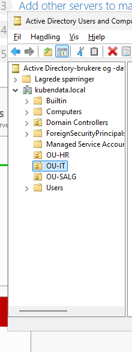

---

## Domenebrukere

### IT-avdelingen

```text
ola.nordmann
kari.hansen
per.olsen
```

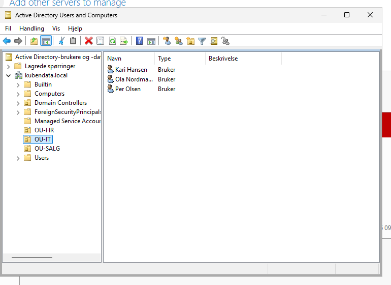

### HR-avdelingen

```text
anne.larsen
nina.berg
hans.jensen
```

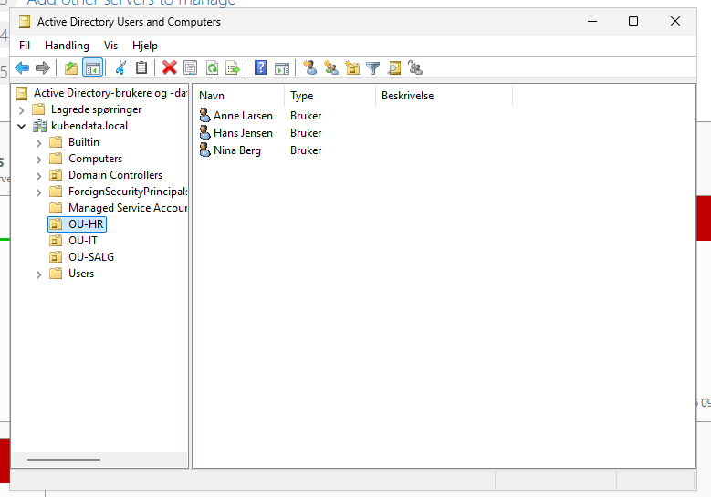

### Salgsavdelingen

```text
liv.andersen
erik.holm
tom.nilsen
```

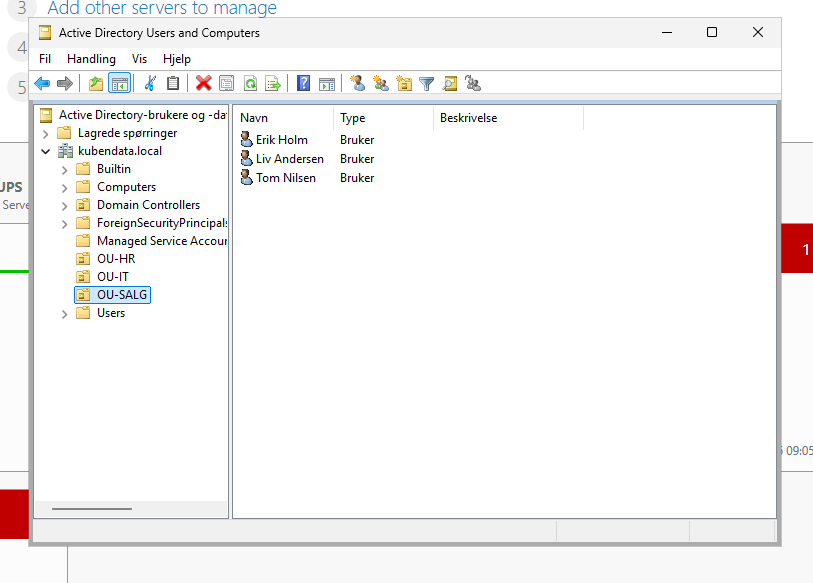

Brukerne ble plassert i riktig Organizational Unit.

---

# Windows 11 domeneklient

En virtuell maskin med Windows 11 Pro ble konfigurert som klientmaskin.

Maskinnavn:

```text
CLIENT-PC2
```

Klienten ble meldt inn i domenet:

```text
kubendata.local
```

Domenebrukere kunne deretter logge inn på klientmaskinen.

Eksempler:

```text
KUBENDATA\ola.nordmann
KUBENDATA\anne.larsen
KUBENDATA\liv.andersen
```

En lokal administratorkonto ble også beholdt for administrasjon og feilsøking.

### Nettverksstatus før DHCP-flytting

Før DHCP-funksjonen ble flyttet til `DC01`, viste klientens nettverkskonfigurasjon at routeren fortsatt var DHCP-server, mens DNS allerede pekte til Domain Controller.

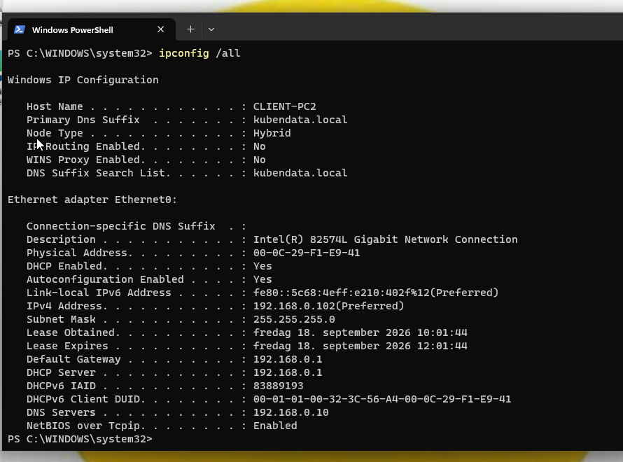

---

# DNS

DNS kjører på `DC01` og er integrert med Active Directory-miljøet.

Domeneklienter bruker:

```text
192.168.0.10
```

som DNS-server.

Dette gjør at klientene kan finne Active Directory-tjenester og slå opp det interne domenet.

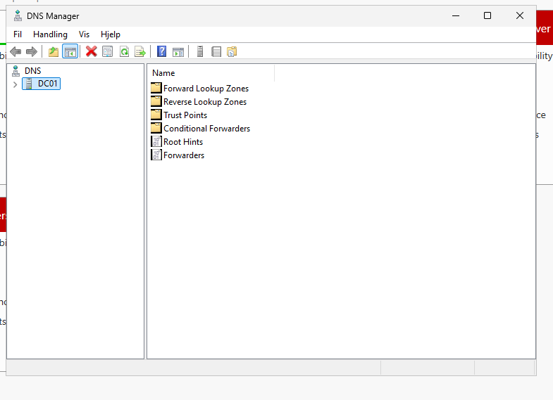

---

## Test av intern DNS

Domenet ble testet med:

```powershell
nslookup kubendata.local
```

Resultatet viste:

```text
kubendata.local
192.168.0.10
```

Dette bekreftet at domenenavnet ble slått opp korrekt til Domain Controller.

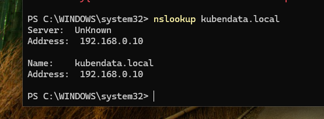

---

## Test av ekstern DNS

Ekstern navneoppløsning ble testet med:

```powershell
nslookup google.com
```

Oppslaget returnerte gyldige IP-adresser.

Dette bekreftet at eksterne DNS-oppslag fungerte.

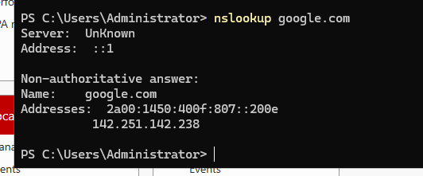

---

## DNS Forwarder

DNS-serveren er konfigurert til å videresende eksterne DNS-forespørsler som den ikke kan løse lokalt.

Konfigurert Forwarder:

```text
192.168.0.1
```

DNS-flyten blir derfor:

```text
CLIENT-PC2
    |
    | DNS-forespørsel
    v
DC01
192.168.0.10
    |
    | Eksternt oppslag
    v
192.168.0.1
    |
    v
Internett-DNS
```

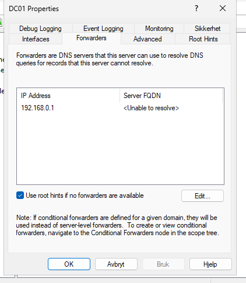

---

## DNS-diagnostikk

DNS-funksjonaliteten på Domain Controller ble også kontrollert med:

```powershell
dcdiag /test:dns
```

DNS-testen ble fullført uten vesentlige feil.

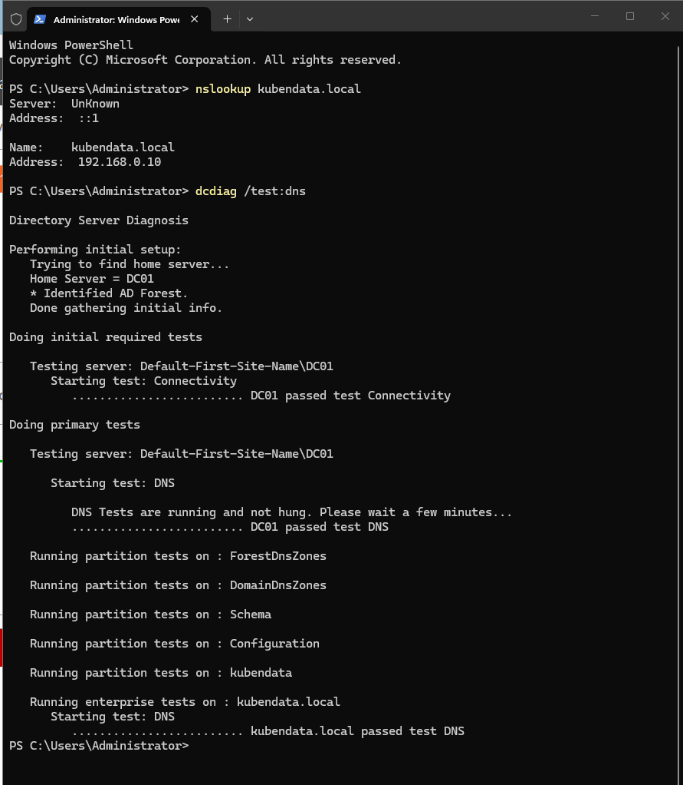

---

# DHCP

DHCP Server-rollen ble installert på `DC01`.

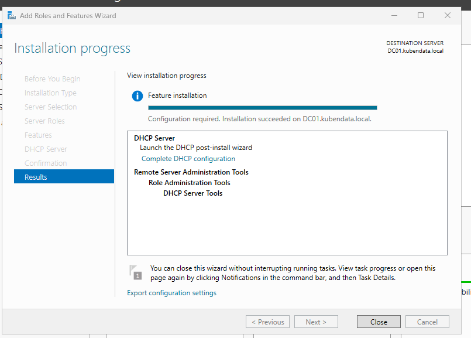

Etter installasjonen ble DHCP synlig i Server Manager og kunne administreres fra DHCP-konsollen.

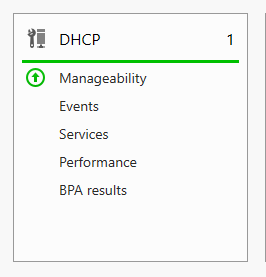

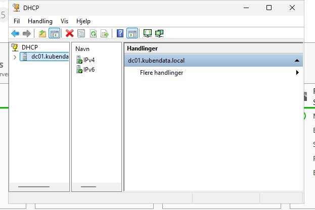

DHCP-serveren ble autorisert i Active Directory før den ble tatt i bruk.

---

## DHCP Scope

DHCP Scope ble konfigurert med:

```text
Start IP:       192.168.0.100
End IP:         192.168.0.200
Subnet Mask:    255.255.255.0
```

Før verdiene ble lagt inn, ble IP Address Range-siden i New Scope Wizard åpnet:

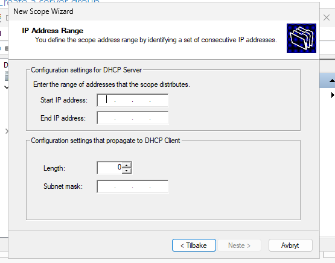

Scope-området ble deretter konfigurert med riktig startadresse, sluttadresse og subnett:

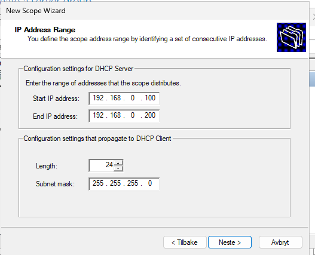

Klientmaskiner kan dermed automatisk motta IP-adresser fra dette området.

---

## DHCP Options

Følgende DHCP Options ble konfigurert:

```text
003 Router
192.168.0.1
```

```text
006 DNS Servers
192.168.0.10
```

```text
015 DNS Domain Name
kubendata.local
```

Dette gjør at klientene automatisk mottar riktig gateway, DNS-server og domenenavn.

### 003 Router

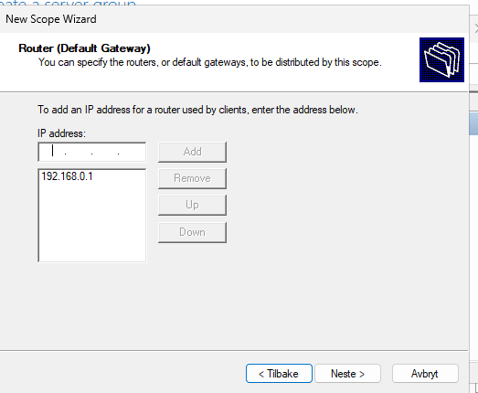

### 006 DNS Servers og 015 DNS Domain Name

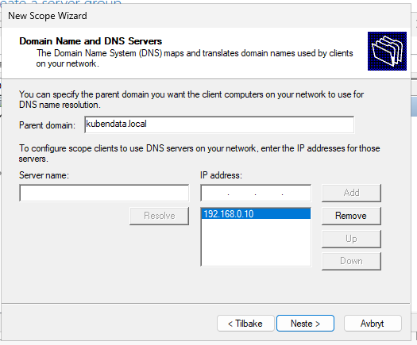

---

## Flytting av DHCP-funksjonen fra router til DC01

Før DHCP Scope ble aktivert på `DC01`, ble DHCP-funksjonen på labrouteren deaktivert.

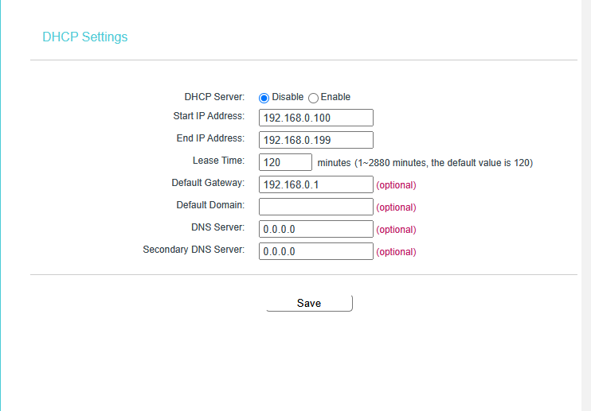

Dette ble gjort for å unngå at to DHCP-servere delte ut IP-adresser på samme nettverk samtidig.

Scope ble først opprettet i inaktiv tilstand:

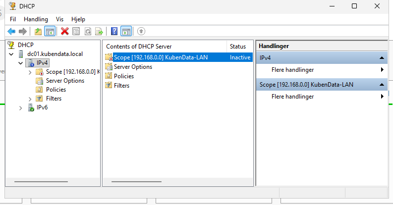

Etter at DHCP på routeren var deaktivert, ble Scope aktivert på `DC01`.

Routeren fortsatte å fungere som:

```text
Default Gateway: 192.168.0.1
```

mens `DC01` overtok oppgaven med å dele ut nettverkskonfigurasjon.

---

## DHCP-test på klienten

Windows 11-klienten ble satt til å hente både IP-adresse og DNS-server automatisk.

Følgende kommandoer ble brukt:

```powershell
ipconfig /release
ipconfig /renew
ipconfig /all
```

Klienten mottok:

```text
IPv4 Address:     192.168.0.102
Subnet Mask:      255.255.255.0
Default Gateway:  192.168.0.1
DHCP Server:      192.168.0.10
DNS Server:       192.168.0.10
```

Først ble den gamle lease-en frigitt og en ny bedt om:

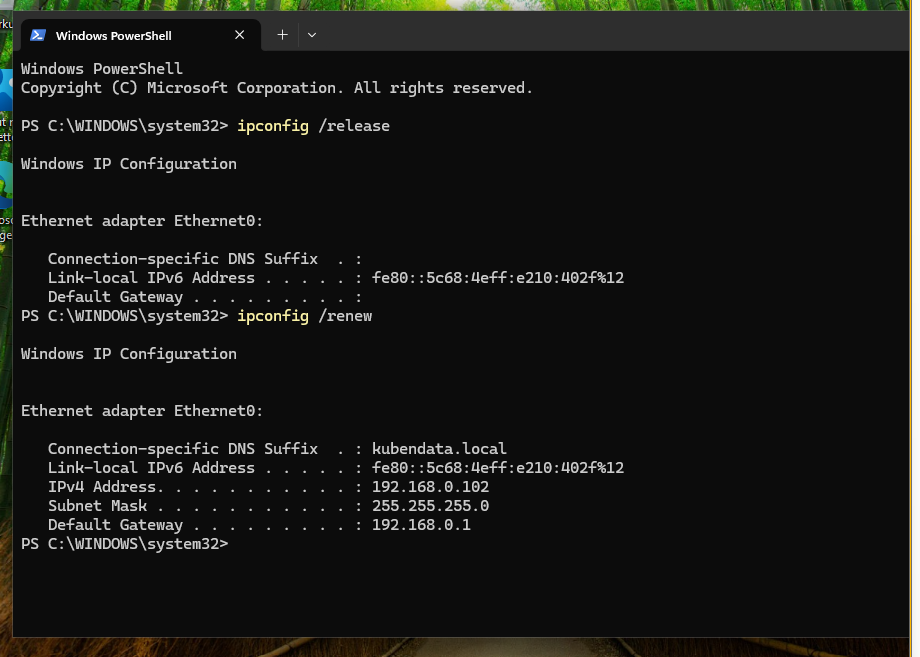

Deretter ble hele nettverkskonfigurasjonen kontrollert:

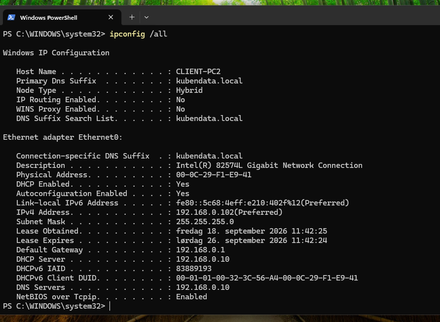

I DHCP-konsollen kunne lease-en også bekreftes fra serversiden:

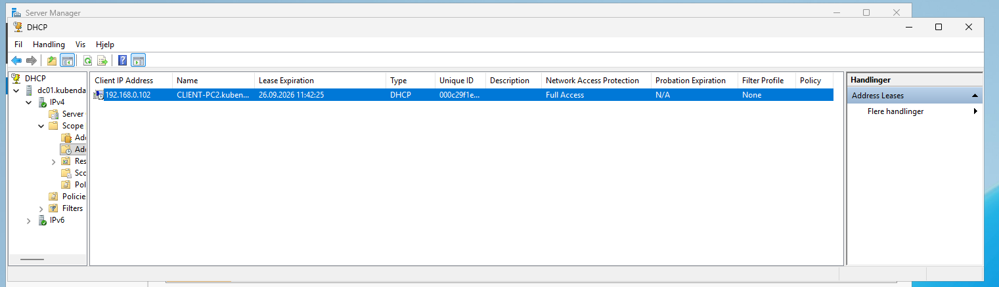

Dette bekreftet at DHCP på `DC01` fungerte korrekt.

---

## Kontroll av DHCP Authorization

Autorisasjonen av DHCP-serveren i Active Directory ble kontrollert med:

```powershell
Get-DhcpServerInDC
```

Resultatet viste:

```text
192.168.0.10
dc01.kubendata.local
```

Dette bekreftet at `DC01` var autorisert som DHCP-server i domenet.

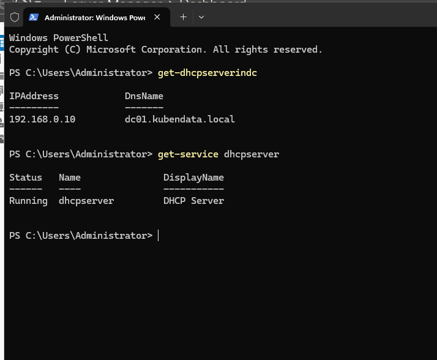

---

## Kontroll av DHCP-tjenesten

DHCP-tjenesten ble kontrollert med:

```powershell
Get-Service DHCPServer
```

Status var:

```text
Running
```

Dette bekreftet at DHCP Server-tjenesten kjørte.

---

# Group Policy

Det ble opprettet separate Group Policy Objects for de tre avdelingene:

```text
GPO-IT
GPO-HR
GPO-SALG
```

Policyene ble koblet slik:

```text
GPO-IT
   |
   v
OU-IT
```

```text
GPO-HR
   |
   v
OU-HR
```

```text
GPO-SALG
   |
   v
OU-SALG
```

Dette gjør det mulig å gi forskjellige avdelinger forskjellige Windows-innstillinger.

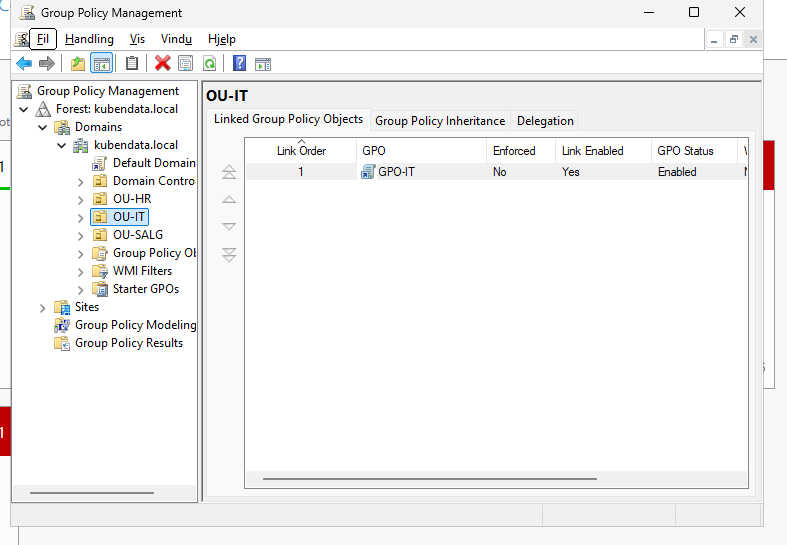

---

## GPO-IT

`GPO-IT` ble koblet til:

```text
OU-IT
```

Policyen inneholder blant annet:

- Begrenset tilgang til Control Panel / Settings
- Innstillinger for Start-menyen
- Automatisk oppstart av et program ved innlogging

Policyen ble testet med brukeren:

```text
ola.nordmann
```

Et program konfigurert gjennom Group Policy startet automatisk etter innlogging.

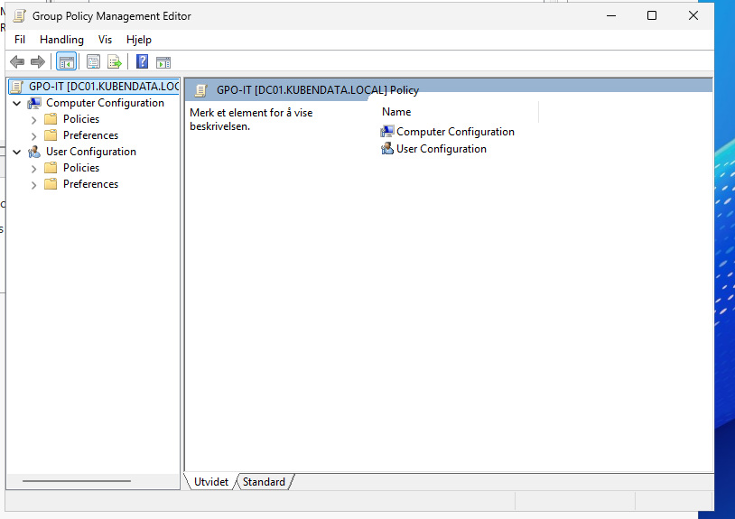

Skjermbildet viser at `GPO-IT` er opprettet og åpnet i Group Policy Management Editor. Selve effekten av policyen ble kontrollert på klienten gjennom innlogging og Group Policy-testing.

---

## GPO-HR

`GPO-HR` ble koblet til:

```text
OU-HR
```

HR-policyen inneholder blant annet:

- Begrenset tilgang til Windows-innstillinger
- Begrensning av endring av skrivebordsinnstillinger
- Felles bakgrunnsbilde for HR-brukerne

Policyen ble testet med:

```text
anne.larsen
```

Det konfigurerte bakgrunnsbildet ble vist korrekt på klientmaskinen.

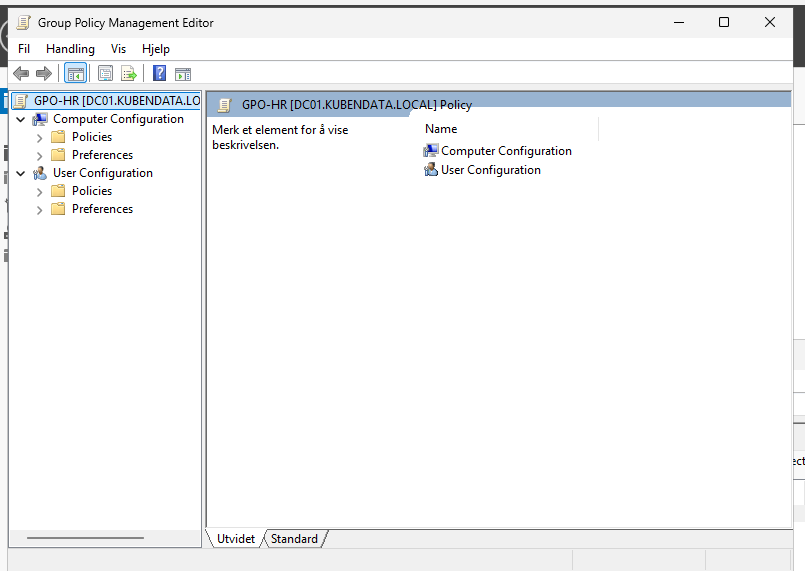

Skjermbildet viser at `GPO-HR` er opprettet og åpnet i Group Policy Management Editor. At policyen faktisk ble brukt, dokumenteres videre med `gpresult`, bakgrunnsbildet og `gpupdate /force`.

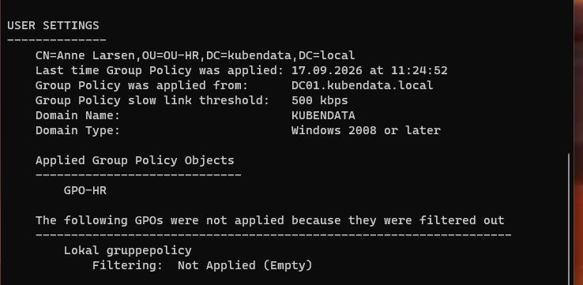


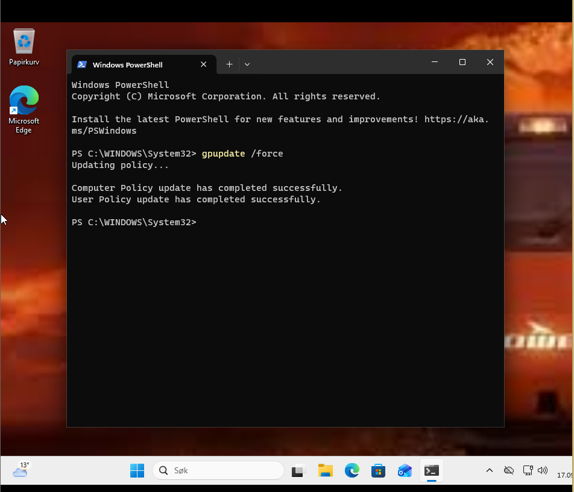

---

## GPO-SALG

`GPO-SALG` ble koblet til:

```text
OU-SALG
```

Salgsavdelingen fikk blant annet:

- Begrensninger i Windows
- Skrivebordsinnstillinger
- Eget bakgrunnsbilde
- Automatisk tilkobling til felles nettverksmappe

Policyen ble testet med:

```text
liv.andersen
```

Bakgrunnsbildet for Salg ble vist korrekt.


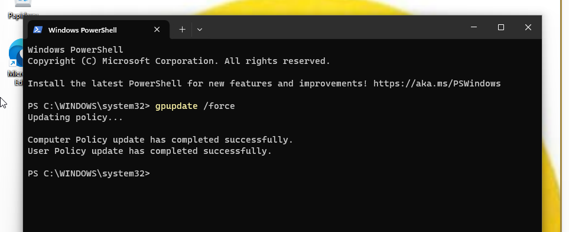

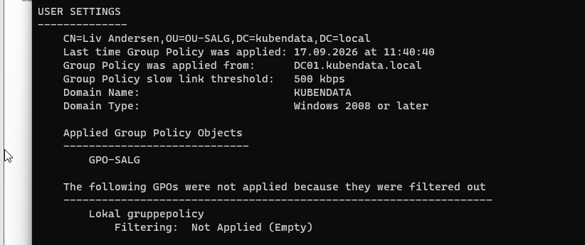

---

# Delt nettverksressurs

En delt mappe ble opprettet på serveren for Salgsavdelingen.

Lokal mappe:

```text
C:\SalgFelles
```

Nettverkssti:

```text
\\DC01\SalgFelles
```

Mappen ble automatisk koblet til brukerne ved hjelp av Group Policy Preferences som:

```text
S:
```

Salgsbrukeren kunne åpne nettverksdisken fra `CLIENT-PC2`.

Dette bekreftet både:

- Group Policy Preferences
- Tilgang til en delt ressurs på serveren

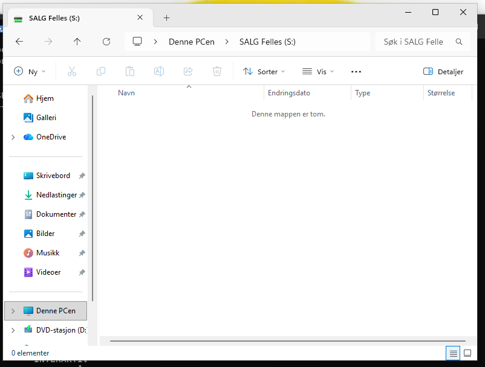

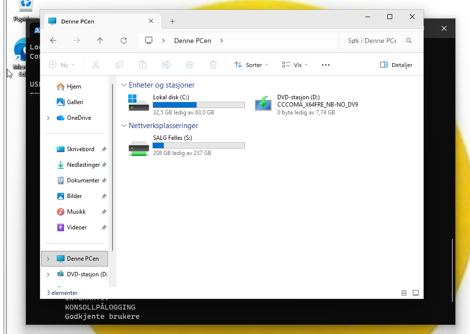

---

# Testing av Group Policy

Group Policy ble oppdatert manuelt med:

```powershell
gpupdate /force
```

Kommandoen bekreftet at både Computer Policy og User Policy ble behandlet.

Resultatet av Group Policy ble kontrollert med:

```powershell
gpresult /r
```

Brukere fra forskjellige avdelinger ble testet.

### IT

```text
ola.nordmann
Applied GPO: GPO-IT
```

### HR

```text
anne.larsen
Applied GPO: GPO-HR
```

### Salg

```text
liv.andersen
Applied GPO: GPO-SALG
```

Dette bekreftet at riktig Group Policy ble brukt på riktig bruker og OU.

---

# Kontroll av Domain Controller

Domain Controller ble kontrollert med:

```powershell
dcdiag
```

De sentrale Active Directory-testene ble fullført korrekt.

DNS ble i tillegg testet med:

```powershell
dcdiag /test:dns
```

DNS-testen besto.

Under den komplette `dcdiag`-testen ble det registrert enkelte advarsler i Windows System Event Log.

De sentrale Active Directory-, DNS-, replikasjons- og tjenestefunksjonene fungerte likevel som forventet.

---

# SPN-feilsøking

Som en del av feilsøkingen ble det kontrollert om domenet hadde dupliserte Service Principal Names.

Følgende kommando ble brukt:

```powershell
setspn -X
```

Resultatet viste:

```text
0 groups of duplicate SPNs
```

Dette bekreftet at det ikke ble funnet dupliserte SPN-oppføringer.

---

# Testoversikt

Følgende funksjonalitet ble testet:

- Windows Server 2025
- Statisk IP på server
- Active Directory Domain Services
- Domain Controller
- Organizational Units
- Domenebrukere
- Windows 11 Domain Join
- Intern DNS
- Ekstern DNS
- DNS-diagnostikk
- DHCP Server
- DHCP Authorization
- DHCP Scope
- DHCP-klient
- DHCP Service
- Group Policy
- Avdelingsspesifikke policyer
- Skrivebordsbakgrunn gjennom GPO
- Mapped Drive
- Domenepålogging
- PowerShell-baserte administrasjonskommandoer

---

# Feilsøking

Prosjektet inneholdt også flere praktiske feilsøkingssituasjoner.

Eksempler:

- Kontroll av at domeneklienter bruker Domain Controller som DNS
- Forskjellen mellom lokal administrator og domenebruker
- Testing av Group Policy med `gpresult`
- Oppdatering av policyer med `gpupdate`
- Kontroll av DHCP Authorization
- Unngå to aktive DHCP-servere på samme nettverk
- Testing av DNS etter DHCP-konfigurasjon
- Analyse av Domain Controller-advarsler
- Kontroll av dupliserte SPN-er

Dette ga praktisk erfaring med både oppsett og systematisk feilsøking.

---

# Hva jeg lærte

Gjennom prosjektet fikk jeg en bedre forståelse av hvordan de viktigste Windows Server-tjenestene samarbeider.

Jeg lærte blant annet:

- forskjellen mellom en lokal brukerkonto og en domenebruker
- hvordan en Domain Controller administrerer brukere og datamaskiner sentralt
- hvorfor DNS er kritisk for Active Directory
- hvordan DHCP kan distribuere IP-adresse, gateway, DNS-server og domenenavn automatisk
- hvordan Organizational Units brukes til å strukturere brukere
- hvordan Group Policy kan gi ulike innstillinger til forskjellige avdelinger
- hvordan `gpupdate /force` og `gpresult /r` brukes til å teste og feilsøke Group Policy
- hvordan `nslookup`, `ipconfig` og `dcdiag` brukes til å verifisere nettverks- og domenetjenester
- hvordan en mapped drive kan distribueres automatisk med Group Policy Preferences
- hvordan systematisk testing kan skille mellom DNS-, DHCP-, GPO- og klientproblemer

Prosjektet ga derfor erfaring med både selve konfigurasjonen og med å kontrollere at løsningene faktisk fungerer fra både server- og klientsiden.

---

# Viktige kommandoer

Følgende kommandoer ble blant annet brukt i prosjektet:

```powershell
hostname
ipconfig /all
ipconfig /release
ipconfig /renew
ping 192.168.0.10
nslookup kubendata.local
nslookup google.com
gpupdate /force
gpresult /r
dcdiag
dcdiag /test:dns
Get-DhcpServerInDC
Get-Service DHCPServer
setspn -X
```

---

# Kompetanse demonstrert i prosjektet

Prosjektet viser praktisk erfaring med:

- Windows Server 2025-administrasjon
- Active Directory Domain Services
- Domain Controller-konfigurasjon
- Active Directory Users and Computers
- Organizational Units
- Brukeradministrasjon
- DNS
- DNS-feilsøking
- DHCP
- DHCP Scope og Options
- DHCP Authorization i Active Directory
- Group Policy Management
- Group Policy Preferences
- Windows 11 domeneklient
- Delte nettverksressurser
- PowerShell
- Nettverksfeilsøking
- Infrastrukturtesting
- Teknisk dokumentasjon

---

# Struktur på repository

Prosjektet organiseres slik:

```text
windows-server-2025-enterprise-lab/
|
|-- README.md
|
`-- screenshots/
    |-- 01-ad-ou-structure.png
    |-- 02-ad-users-hr.png
    |-- 03-ad-users-it.png
    |-- ...
    `-- 34-gpo-hr-editor.png
```

Skjermbildene lagres samlet i `screenshots/`, og hvert skjermbilde vises direkte under den relevante delen i denne README-filen.

---

# Labmiljø sammenlignet med produksjon

Dette prosjektet er et mindre opplæringsmiljø og er ikke ment som en full produksjonsarkitektur.

I et større produksjonsmiljø ville man normalt vurdert flere tiltak, for eksempel:

- flere Domain Controllers for redundans
- DHCP Failover eller annen redundans
- regelmessig backup og test av restore
- segmentering med VLAN og tydeligere nettverksgrenser
- strengere prinsipper for administrative rettigheter
- sentral logging, overvåking og varsling
- dokumenterte rutiner for patching og endringshåndtering
- sterkere sikkerhetskonfigurasjon og hardening

Labmiljøet fokuserer på å demonstrere grunnleggende arkitektur, administrasjon, testing og feilsøking i et Windows-domene.

---

# Sikkerhet

Ingen passord, autentiseringshemmeligheter, recovery keys eller andre sensitive påloggingsopplysninger er inkludert i repositoryet.

IP-adressene og domenenavnet som vises i dokumentasjonen tilhører det isolerte opplæringsmiljøet.

---

# Prosjektstatus

**Fullført**

Windows Server 2025-miljøet ble konfigurert og testet med:

```text
Active Directory
DNS
DHCP
Group Policy
Windows 11 domeneklient
```

Prosjektet viser et komplett mindre Windows-domene fra serverkonfigurasjon til klienttesting og feilsøking.
